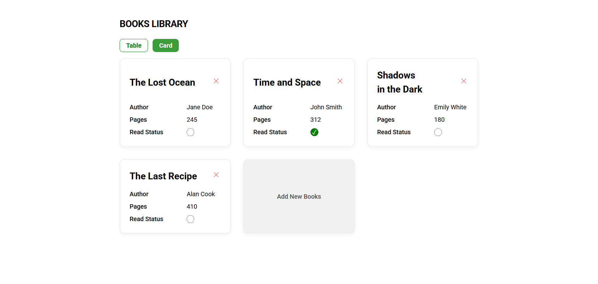
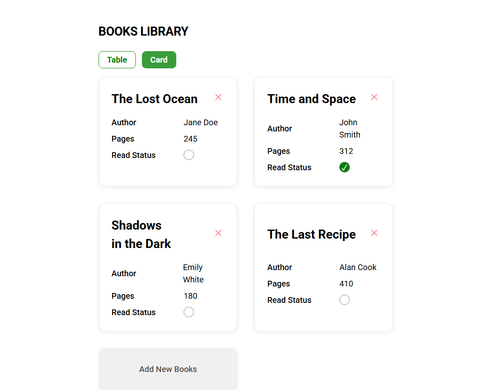
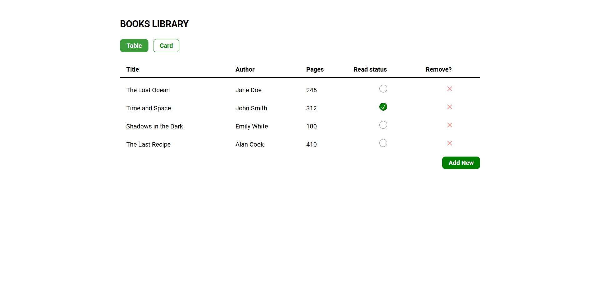
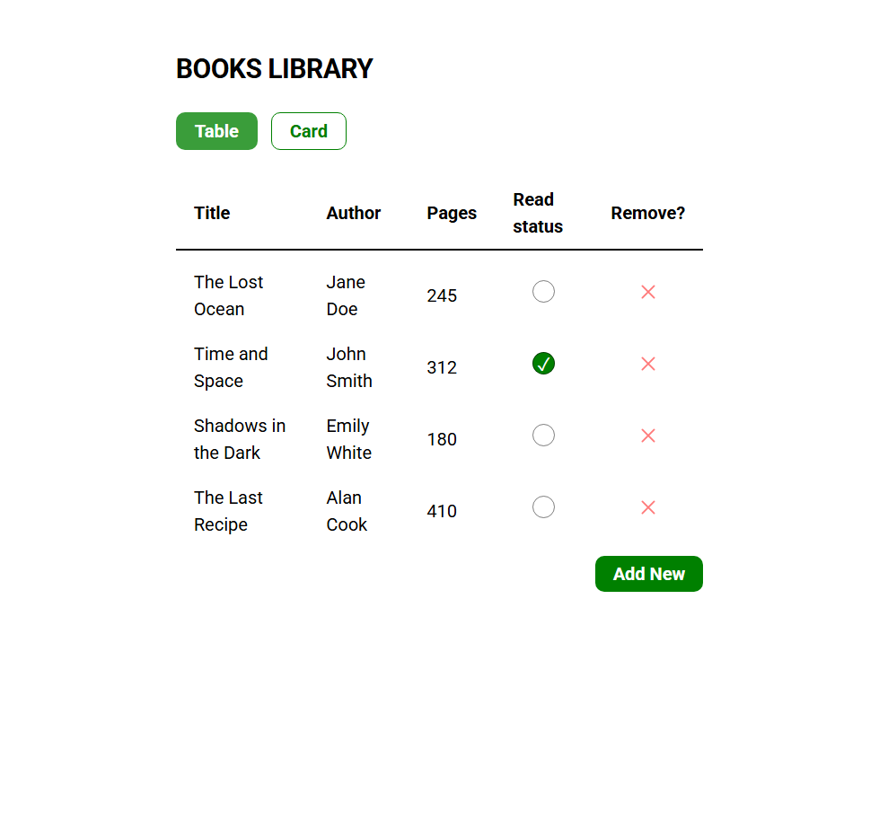

# Project

This is a library project to store some books. The focus here was mostly on the functionality and code organization, not styling the UI.

_Note: this project uses prototypal inheritance with construction functions and not ES6 classes._

**Live demo: [Website](https://simeon2002.github.io/TOP-library/)**

## Implemented features

- Display a list of books
- Store and fetch books from localstorage
- Add new books from the list
- remove books from the list
- Update the read status of a book
- Two book views: a table and cards view

## Implementation details

- Built with construction functions
- Used a simple Book and App class separation
- Event delegation for remove and toggle actions
- A model dialog to pop up a book form
- Local storage to persist data between reloads
- Card and table layouts separated with a state variable (easily extendable)
- Use of subgrid to implement card layout
- Semantic HTML structure

## Main learnings

- Learning to use model dialog
- Learning to use local storage
- Using constructor functions to create classes instead of ES6 classes
- Organizing and refactoring code into separate responsibilities (render methods, data methods and controller methods that coordinate the first two)

## App Views

Card Desktop and Mobile, respectively

  
  

Table Desktop and Mobile, respectively

  
  

